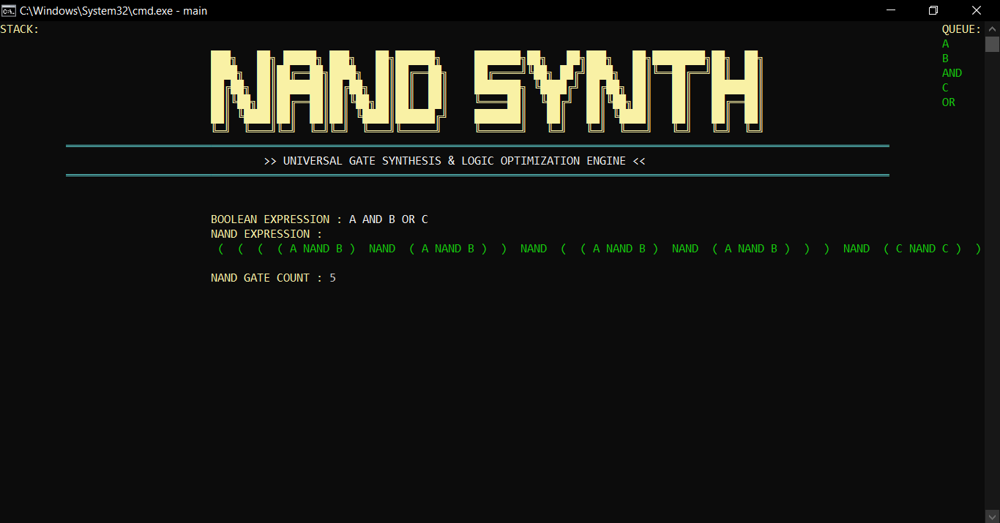
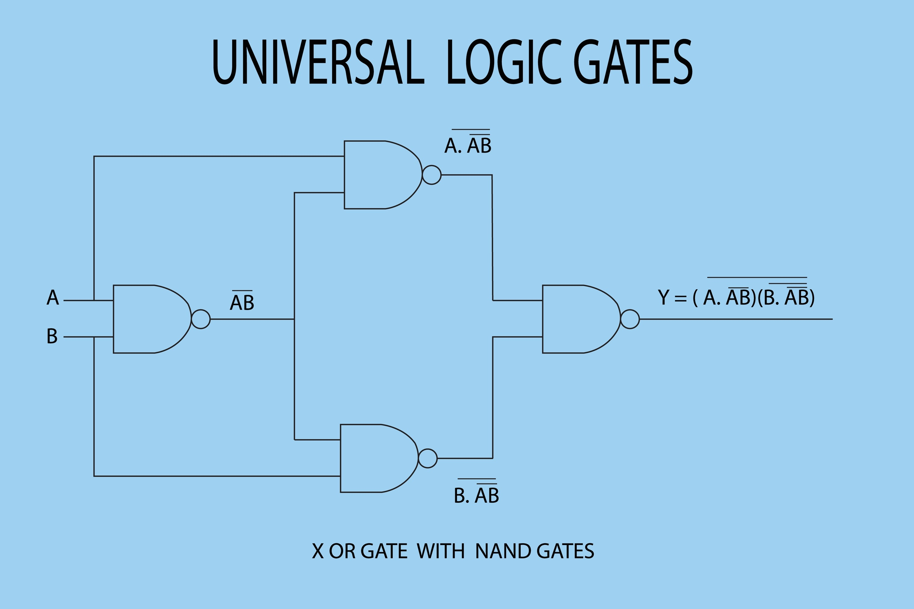

# Universal Gate Synthesis Tool

[](https://isocpp.org/)
[](LICENSE)
[](https://www.microsoft.com/windows)

A comprehensive Boolean circuit synthesis tool that converts Boolean expressions into equivalent circuits using only universal gates (NAND or NOR). Demonstrates gate completeness theory with comparative efficiency analysis and truth table verification.




## 🎯 Features

### Core Synthesis
- **NAND-Only Synthesis** - Convert Boolean expressions to pure NAND gate implementations
- **NOR-Only Synthesis** - Convert Boolean expressions to pure NOR gate implementations
- **Extended Operators** - Support for AND, OR, NOT, and XOR with proper precedence
- **Nested Expressions** - Handle arbitrary parenthesis grouping

### Analysis Tools
- **Gate Count Comparison** - Side-by-side efficiency analysis of NAND vs NOR
- **Truth Table Generation** - Complete verification with all input combinations
- **Step-by-Step Visualization** - Watch the synthesis process unfold

### User Interface
- **Interactive Menu** - Arrow key navigation
- **Color-Coded Output** - Enhanced readability with Windows console colors
- **Real-Time Feedback** - Stack/queue visualization during parsing

## 🚀 Quick Start

### Prerequisites
- Windows OS (7/8/10/11)
- MinGW-w64 GCC compiler or Visual Studio
- C++11 or higher

### Installation

```bash
# Clone the repository
git clone https://github.com/mUmarSaga/Discrete_Math_Project.git
cd Discrete_Math_Project

# Compile
g++ main.cpp -o synth.exe

# Run
./synth.exe
```

### Usage

1. Launch the program
2. Select an option from the menu (use arrow keys):
   - `[1]` NAND Synthesis
   - `[2]` NOR Synthesis
   - `[3]` Compare NAND vs NOR
   - `[4]` Generate Truth Table
   - `[5]` Exit

3. Enter your Boolean expression:
   ```
   Variables:  A-Z (single uppercase letters)
   Operators:  AND, OR, NOT, XOR (uppercase)
   Grouping:   Parentheses ()
   
   Example:    (A AND B) OR (NOT C)
   ```

4. View results and gate counts

## 📚 Examples

### Basic Operations
```
Input:  A AND B
NAND:   2 gates
NOR:    3 gates
Winner: NAND (33% fewer gates)
```

### Complex Expressions
```
Input:  (A AND B) OR (C XOR D)
NAND:   14 gates
NOR:    14 gates
Winner: TIE
```

### Truth Table
```
Input:  A XOR B

A    B    Result
0    0      0
0    1      1
1    0      1
1    1      0
```

## 🧮 Mathematical Foundation

### Universal Gate Completeness

**NAND Gate Synthesis:**
- `NOT A = A NAND A` (1 gate)
- `A AND B = (A NAND B) NAND (A NAND B)` (2 gates)
- `A OR B = (A NAND A) NAND (B NAND B)` (3 gates)
- `A XOR B = Complex 9-gate implementation`

**NOR Gate Synthesis:**
- `NOT A = A NOR A` (1 gate)
- `A AND B = (A NOR A) NOR (B NOR B)` (3 gates)
- `A OR B = (A NOR B) NOR (A NOR B)` (2 gates)
- `A XOR B = Complex 9-gate implementation`

### Key Insight
Gate efficiency depends on expression structure:
- **AND-heavy expressions** → NAND more efficient
- **OR-heavy expressions** → NOR more efficient
- **XOR operations** → Equally expensive in both (9 gates)

## 🏗️ Architecture

```
┌─────────────────┐
│  User Input     │
└────────┬────────┘
         │
         ▼
┌─────────────────┐
│ Expression      │
│ Parser          │ (Shunting Yard Algorithm)
│ (Infix→Postfix) │
└────────┬────────┘
         │
    ┌────┴────┐
    │         │
    ▼         ▼
┌────────┐ ┌────────┐
│  NAND  │ │  NOR   │
│Synth   │ │ Synth  │
└────┬───┘ └───┬────┘
     │         │
     └────┬────┘
          ▼
    ┌──────────┐
    │ Truth    │
    │ Table    │
    └──────────┘
```

## 🔧 Technical Details

### Algorithms
- **Shunting Yard Algorithm** - Infix to postfix conversion with operator precedence
- **Stack-Based Synthesis** - Postfix evaluation and gate substitution
- **Exhaustive Enumeration** - Truth table generation (O(2^n))

### Data Structures
- `std::stack` - Operator precedence management
- `std::queue` - Postfix expression storage
- `std::map` - Variable to boolean value mapping
- `std::vector` - Dynamic variable storage

### Complexity
- **Parsing**: O(n) where n = expression length
- **Synthesis**: O(n) where n = number of operators
- **Truth Table**: O(2^v × e) where v = variables, e = expression complexity

## 🎓 Academic Context

**Course:** CS-101 Discrete Mathematics  
**Institution:** University of Engineering and Technology, Lahore  
**Concepts Applied:**
- Boolean Algebra (Rosen Chapter 1)
- Universal Gates (Rosen Chapter 12)
- Propositional Logic
- Algorithm Design

## 📊 Test Results

| Expression | NAND Gates | NOR Gates | Winner | Efficiency |
|------------|------------|-----------|--------|------------|
| A AND B | 2 | 3 | NAND | 33% |
| A OR B | 3 | 2 | NOR | 33% |
| A XOR B | 9 | 9 | TIE | 0% |
| (A AND B) OR C | 5 | 5 | TIE | 0% |
| NOT(A AND B) | 3 | 4 | NAND | 25% |
| (A OR B) AND (C OR D) | 9 | 8 | NOR | 11% |

**Average Optimization Potential:** 17% between NAND and NOR implementations

## 🔮 Future Enhancements

- [ ] **Circuit Minimization** - Implement Karnaugh maps for expression simplification
- [ ] **DAG Representation** - Replace string-based synthesis with graph structure
- [ ] **Circuit Depth Analysis** - Calculate propagation delay
- [ ] **HDL Export** - Generate Verilog/VHDL code
- [ ] **Cross-Platform UI** - Port to ncurses for Linux/macOS support
- [ ] **Multi-Character Variables** - Support for A1, var_x naming

## 🐛 Known Limitations

1. **Expression Growth** - String-based approach can produce lengthy expressions for complex circuits
2. **No Optimization** - Does not minimize Boolean expressions before synthesis
3. **Single-Char Variables** - Limited to A-Z (26 variables max)
4. **Windows-Only** - Console API limits portability
5. **No Circuit Depth** - Only calculates gate count, not propagation delay

## 🤝 Contributing

Contributions are welcome! Please feel free to submit a Pull Request. For major changes:

1. Fork the repository
2. Create your feature branch (`git checkout -b feature/AmazingFeature`)
3. Commit your changes (`git commit -m 'Add some AmazingFeature'`)
4. Push to the branch (`git push origin feature/AmazingFeature`)
5. Open a Pull Request

## 📝 License

This project is licensed under the MIT License - see the [LICENSE](LICENSE) file for details.

## 👤 Author

**mUmar**
- GitHub: [mUmarSaga](https://github.com/mUmarSaga)
- Email: umar342342342@gmail.com
- University: UET Lahore

## 🙏 Acknowledgments

- **Prof. Kenneth H. Rosen** - *Discrete Mathematics and Its Applications* (foundational theory)
- **Mr. Waqas Ali** - Course instructor and project guidance
- **Edsger W. Dijkstra** - Shunting Yard algorithm
- **UET Lahore CS Department** - Academic support and resources

## 📚 References

1. Rosen, K. H. (2019). *Discrete Mathematics and Its Applications* (8th Ed.)
2. Mano, M. M., & Ciletti, M. D. (2017). *Digital Design* (6th Ed.)
3. Dijkstra, E. W. (1961). Shunting Yard Algorithm

---

⭐ **Star this repo if you found it helpful!**

📫 **Questions?** Open an issue or reach out via email.

🔗 **My Other Projects:**
- [8 bit breadboard computer](https://github.com/mUmarSaga/Ben_eater_sap_1)

